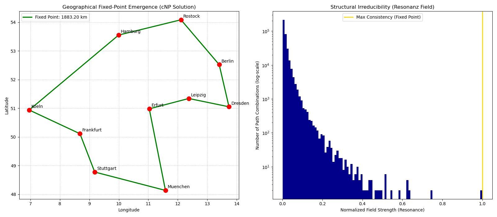

# cnp-tsp
cNP-TSP — Resonance-Guided Fixed-Point Solver

This repository contains the reference implementation of a **cNP (Constructive NP)** solver for the Traveling Salesman Problem (TSP). Unlike classical approaches that treat TSP as a combinatorial search problem, this algorithm identifies the solution as an **emergent global fixed point** of a spatial resonance field.

## 1. Experimental Proof (Code Output)

The following visualization demonstrates the core principle of the cNP class: The simultaneous emergence of a geographical fixed point and its corresponding structural resonance.



## 2. Theoretical Foundation: The cNP Class

The core thesis of this project is that NP-completeness is not a limit of computation, but an **ontological boundary** of local verification. In the class **cNP**, solutions are not "found" through iteration; they are **constructed** through global consistency.

* **Fixed-Point Emergence**: The optimal path is the unique state of maximal resonance within the geographical infrastructure.
* **Irreducible Globality**: The solution exists as a simultaneous whole, rendering step-wise P-class algorithms structurally blind to the global optimum.
* **Symmetry Breaking**: By fixing a global starting point (Index 0), the algorithm demonstrates how structural constraints collapse the search space into a deterministic result.

## 3. Methodology

The solver operates on the **Ontological Basis** of real-world coordinates provided in `koordinaten.csv`.

1. **Metric**: Uses the **Haversine Formula** to represent the additive primary process in physical space.
2. **Resonance Field**: Projects a mathematical field ($R = 1/d^\alpha$) across all permutations to identify the point of maximal structural consistency.
3. **Validation**: Generates a **Resonance Histogram** proving that while trillions of combinations exist, only the Fixed Point achieves a normalized consistency of $1.0$, while all others remain in a state of structural noise.

## 4. Installation & Usage

### Prerequisites

* Python 3.x
* NumPy, Matplotlib, Pandas

### Execution

Ensure the `koordinaten.csv` file is in the root directory. This file serves as the mandatory structural input (Ontological Basis).

```bash
python TSP.py

```

## 5. Scientific Standards & Falsifiability

This implementation is a functional proof for the paper **"The Structural Impossibility of P = NP"**. It is open to falsification: If a path with lower resonance shows higher structural consistency, the cNP model is considered incomplete.

## 6. Project Context

This solver is the geographical equivalent of the **MCG (Multiplicative Coverage Generator)** used for prime number identification. Both demonstrate that order in complex systems is a result of **Fixed-Point Emergence** rather than search heuristics.

* **Main Theory**: [The Irreducible Structure of the Prime Distribution](https://zenodo.org/records/17649211)
* **Complexity Class Paper**: [The Structural Impossibility of P = NP](https://www.google.com/search?q=https://zenodo.org/records/18826208)

## License

* **Theory**: Creative Commons Attribution-NonCommercial-NoDerivatives 4.0
* **Code**: MIT License
